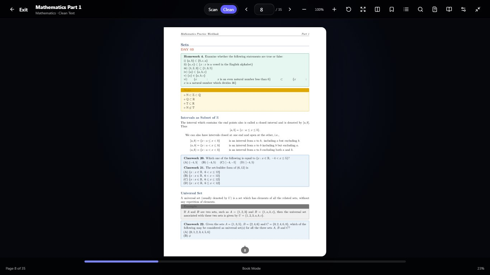

# Upload Your Own E-Book — repair and acceptance report

Work started 3 October 2026; report completed 4 October 2026. This report records validation before publication. A subsequent explicit user request authorized committing and pushing the accumulated changes with detailed Settings update logs. That authorization does not apply the database migration or remove the live-acceptance blocker below; statements about no commit/push refer to the original repair phase.

## 1. Executive summary

Implemented a substantive upload, storage, extraction, shared-reader and study-tool repair. The 155 focused/relevant automated checks pass; TypeScript, repository-wide lint and the production build pass. **The final product acceptance standard is NOT yet met:** this checkout's configured database URL points to legacy SQLite while the Prisma schema requires PostgreSQL. Signed-in upload/reopen, actual account persistence and live LAM/question quality cannot be honestly certified without a working PostgreSQL test environment and the additive migration. No authentication bypass, production migration, commit, push or deployment was performed.

## 2. Root causes discovered

- Database-provider/configuration mismatch blocks real authenticated database workflows independently of the UI.
- File selection silently started upload; no staged confirmation, client signature validation or stable retry reference.
- File storage accounting omitted existing custom books; book creation and monthly usage commitment were separate writes.
- Post-save lookup/audit failures could report failure despite a saved book; retry reservations could remain unusable.
- Unicode filenames could break HTTP `Content-Disposition` headers.
- List/detail endpoints selected and exposed excessive book bodies instead of bounded metadata/page content.
- A long PDF was parsed in one deadline; interrupted work repeated completed pages. Leases exceeded route duration.
- Mixed text/scanned books were denied all indexing instead of retaining readable pages and original page numbers.
- Retry reset the resource/job but not the book's failed status, so library polling stopped.
- Required PDF.js fonts, character maps and WASM assets were not explicitly traced for these serverless routes; Windows asset path separators were incompatible with PDF.js's file reader.
- Upload search was disabled by the shared reader's scan-source check, despite available extracted text.
- Reading position/bookmarks were device-only; uploaded page notes and account sync were missing.
- Refresh lost the active upload reader; failed deletion/update responses were ignored by the library.
- Ask LAM opened a Plus-specific tutor destination rather than the shared top-bar LAM with private book context.
- Practice retrieval was not constrained to the selected pages; old results could remain during a new request; PDF and AI errors shared one state.
- Guest sign-in dialog inherited an overly narrow desktop maximum and lacked explicit focus restoration.

## 3. Existing architecture

Next.js App Router, Prisma/PostgreSQL, `CustomEbook`, private `StudyResource`, page-aware `ResourceChunk`, durable leased `ResourceJob`, existing AI schemas and the shared `BookModeReader`. The original architecture explicitly stores bounded PDF bytes in PostgreSQL `Bytes`; this adapter is retained (4 MB/file, 500 pages, 2 million extracted characters). No temporary disk file or invented public blob URL is used. Existing built-in text/scan adapters and styling remain intact.

## 4. Upload pipeline

Select/drop PDF → validate → show filename/size/optional title → explicit Upload/Remove → authenticated, origin-checked bounded multipart POST → hash/idempotency check → storage/quota transaction → private queued resource → extraction/classification/indexing → shared reader. Upload failure retains the selected file/reference for retry. Duplicate success identifies the existing library book rather than creating another copy. No fake progress percentage.

## 5. Storage

Persistent original bytes are created atomically with book/resource/job. Standard allowance now sums active `StoredFile` bytes plus active standard `CustomEbook` bytes under the account row lock. Initial-setup bonus remains a separate allocation. Credit commitment uses the same transaction; failed writes roll back and release the reservation. No object-store credentials are required by this retained bounded adapter. Larger file support would require a separately reviewed object-storage migration, not silently raising this limit.

## 6. Processing states

Reuse persisted queued/running/extracting/classifying/indexing/ready, needs-review/needs-OCR, rejected and retryable-failed states. The library shows actual stage, completed page count and actionable errors. Retrying a safe failed job resets the book as well as the job; permanently unsafe/corrupt/protected files require correction. Deletion cancels an import through the worker lease fence. Polling/library reopen resumes eligible work; processing with the app completely closed requires the existing external worker endpoint to be scheduled.

## 7. PDF parsing

PDF.js checks page count and active JavaScript, handles password/corrupt errors explicitly, preserves original byte ownership, reads meaningful metadata titles and top-level outline destinations, and loads local font/CMap/WASM assets. Windows paths are normalized. No external PDF asset fetch is performed by the server parser. Detected document outline, not fabricated chapter headings, supplies the reader contents panel.

## 8. Extraction

Up to 30 pages per invocation; checkpoints every 10 pages/end; soft 18-second batch boundary and 35-second parser deadline. Existing completed pages are skipped. Successful partial batches requeue without spending interruption retries. Lease-fenced checkpoints precede indexing; an indexing retry reuses saved extraction. Text preserves line/page boundaries and is indexed into page-labelled chunks.

## 9. Scanned PDF / OCR

Existing OCR belongs to another workflow and is not a verified custom-book OCR pipeline. No automated OCR success is claimed here. Image-only/low-text pages receive a clear warning; the original PDF remains readable. Mixed PDFs index readable pages only, with accurate numbers. An all-scan book has no invented searchable text or AI study aids. The conservative 30-character heuristic may also flag a very short legitimate page.

## 10. Database/schema

Add `CustomEbook.readingState` JSON with a safe empty default. Store bounded page, bookmarks, notes and last-opened timestamp. Updates are authenticated and serialized by a book row lock, merging individual page operations rather than overwriting another device's unrelated notes. Original stored books/bytes are not rewritten by the migration. Prisma client generation ran successfully; migration application did not run.

## 11. Shared reader

Uploaded PDF is a source adapter to the existing `BookModeReader`, not a new iframe/PDF viewer product. It uses the existing toolbar, navigation, zoom/fit, single/spread modes, fullscreen, contents, search panel, bookmarks, questions/tools and settings. Canvas rendering is deferred until a page is visible. PDF.js is loaded only when a book opens.

## 12. Feature parity

Applicable reader navigation, zoom, fullscreen, bookmarks, page notes, search, detected contents, LAM, page/range practice, summaries and resume are wired. Unsupported scan-to-clean conversion is not advertised. User PDF pages do not inherit the curated book's hand-authored exercises, diagrams or clean-text page mapping. An empty extracted page explicitly limits text tools. Generated written answers are temporary practice responses, not persisted page notes or exam grades.

## 13. Library

Keep the existing E-Book upload surface. Integrated private cards provide Scholar-styled title covers (no broken image placeholder), real status, reading progress, Resume/Open, Rename, Retry where safe and confirmed Delete/Cancel. Optional user title is respected over parser metadata. Rename also updates the resource title and cannot race a processing worker. The current list endpoint is bounded to the newest 200 books; older entries remain stored and addressable but library pagination beyond that is not implemented.

## 14. Search

Owner-scoped server text search returns bounded snippets and actual matching pages, using the same reader panel/page jump. Private indexed content also participates in the existing resource retrieval system (PostgreSQL text search/lexical ranking; no new embedding provider). Debounce, abort and stale-result checks prevent cross-query UI races. Blank scanned pages cannot be text-searched. A very common query is capped at 120 matching chunks/60 distinct pages.

## 15. Notes

Page notes save on every edit to a versioned local retry journal, then coalesce/debounce account PATCH operations. Page/user/book ownership is server-enforced; note size and request bodies are bounded. A cloud or browser-storage failure is visible, with retry; the UI does not falsely claim a device save if device storage fails. Keep the book open if neither storage path is available. Notes are rendered as text/controlled fields, not executable HTML.

## 16. Bookmarks

Account-saved per-page bookmarks retain IDs/timestamps and optional notes. Removal is an idempotent page operation. Old device-only bookmarks/progress are migrated into the new journal/account operations without replacing newer cloud progress or notes. Legacy storage is kept as a backup until the book is explicitly deleted; a valid v2 journal prevents removed legacy bookmarks being imported repeatedly.

## 17. Progress / resume

Opening and page changes save page/last-opened timestamp. Cards calculate reading percentage and offer Resume. A `?book=<id>` URL lets the account library restore the reader after refresh; source bytes and page data still require server ownership checks. Account JSON supports another device, but real cross-device/login acceptance remains unverified due to the database blocker.

## 18. LAM

Ask about this page opens the existing top-bar LAM with book ID/title/page context, without requiring the Plus live-tutor route. The server rechecks ownership/readiness, loads real book content, enforces class context and retrieves owned chunks. Existing provider availability and free/Plus/BYOK rules are unchanged. Live generation is not proven by mocked route tests.

## 19. Page context

Explicit requests such as page 5, page 12 and pages 20–25 resolve to the requested range rather than the currently open page. Ranges are limited to 25 real pages and validated against the book; invalid ranges fail actionably. Current-page requests default to the current page. Whole-book questions use labelled sampled retrieval, not a false claim that every page was read.

## 20. Citations

Reuse real `S#` source records with book title/page and detected headings. Existing citation filtering rejects invented source IDs/links. Page-range retrieval excludes other pages and accounts. LAM is instructed to disclose omitted/missing pages; the retrieval budget does not guarantee exhaustive coverage of every dense page in a 25-page range.

## 21. Questions

Current page or selected range supports MCQ, short/numerical-capable written answer, long answer and mixed practice using existing checkpoint/mock-question schemas. Server-retrieved excerpts ground the request; no whole extracted book is shipped to the client prompt. Clear old outputs on regeneration/range changes; cancel stale requests on page changes. MCQ feedback and worked-model-answer self-review are supported. UI labels results as AI-generated, not official exercises. Provider-generated correctness/source quality still requires live acceptance with known content; prompt constraints alone are not a guarantee.

## 22. Large PDFs

The real parser test extracts/resumes a 125-page generated physics document in five batches and accepts a valid near-4 MB PDF. This is a synthetic fixture, **not** evidence that every complex 100+ page textbook/font/image arrangement works. Maximum 500 pages/2 million characters and lazy current/spread-page rendering bound this adapter. Rendering is not a security sandbox; CPU/memory isolation for adversarial compressed PDFs is not added.

## 23. Mobile

390×844 checks confirmed guest dialog width 374px and shared reader/body width 390px with usable controls and no horizontal overflow. 1366×768 checks confirmed the guest dialog is 1024px wide. Screenshots below. Actual signed-in mobile file selection/upload/processing cannot be certified with the unavailable database; no simulated mobile upload is presented as a real one.

## 24. Android WebView

Inspected the React Native WebView shell and ordinary HTML PDF file input; no native code was changed. No attached Android device/emulator was available for a real content-URI/file-chooser/upload test. Permissions, picker return MIME and actual POST need device acceptance; desktop viewport emulation is not Android proof.

## 25. Security

Authentication and server ownership on metadata/file/page/search/mutations; existing mutation origin rejection; rate limits; streamed body ceilings; extension/MIME/signature/size validation; page/text limits; active-script rejection; parameterized SQL; safe filenames and RFC5987 headers; private no-store file access with nosniff/sandbox/same-origin policy. No authentication/plan restrictions were weakened. Large decompression CPU/memory behavior still deserves adversarial sandbox testing beyond these bounds.

## 26. Privacy isolation

Library, original PDF, reader state, indexing/retrieval, search and deletion queries retain server owner constraints. Unit tests use distinct mocked accounts to verify 404 denial on another user's metadata/file/page/search/write/delete. This is not a two-real-account live test. Logs contain status/code/IDs/size, not document text, tokens or secrets.

## 27. Prompt injection

Reuse the existing JSON reference-data boundary and source whitelist. Uploaded text is untrusted evidence, never instructions. LAM/private practice instructions forbid filling unsupported book claims with general knowledge. Existing injection/citation boundary tests pass. No claim that any LLM is infallibly immune to prompt injection.

## 28. Delete / cleanup

Confirmation names the book and explains loss of PDF/reading data. Successful transaction soft-deletes the book/resource, clears original bytes/extracted text/page state, deletes jobs/chunks/artifacts, retires source identity and fences stale workers. Both class profiles' local reading journals/backups are removed after success. Failed requests leave cards/data intact and show an error. No unknown historical production uploads were deleted or scanned without a working authorized database. Generic resource deletion also clears linked book reading state.

## 29. Exact files changed for this repair

Updated:

- `next.config.ts`
- `prisma/schema.prisma`
- `src/app/api/ebooks/route.ts`
- `src/app/api/ebooks/[ebookId]/route.ts`
- `src/app/api/files/quota/route.ts`
- `src/app/api/resources/[id]/route.ts`
- `src/app/api/ai/route.ts`
- `src/app/api/lam/chat/route.ts`
- `src/components/ebook/book-mode-reader.tsx`
- `src/components/ebook/custom-ebook-library.tsx`
- `src/components/ebook/uploaded-book-reader.tsx`
- `src/components/views/settings.tsx` (only the new E-Book update-log entry in this turn)
- `src/lib/ai.ts`
- `src/lib/ai/schemas.ts`
- `src/lib/resources/types.ts`
- `src/lib/resources/service.ts`
- `src/lib/resources/pdf.ts`
- `src/lib/resources/jobs.ts`
- `src/lib/subscriptions/monthly-usage.ts`
- `tests/resource-api.test.ts`
- `tests/resource-jobs.test.ts`
- `tests/lamtube-quota.test.ts` (regression test for shared monthly-reservation retry)

Created:

- `src/lib/ebooks/contracts.ts`
- `src/lib/ebooks/storage.ts`
- `src/components/ebook/uploaded-book-state.ts`
- `prisma/migrations/20261003190000_ebook_reading_state/migration.sql`
- `tests/ebook-api.test.ts`
- `tests/ebook-upload.test.ts`
- `tests/ebook-reading.test.ts`
- `tests/ebook-fixtures.ts`
- `tests/ebook-parser-real.test.ts`
- `docs/ebook-reliability-repair.md`

Browser artifacts: `test-artifacts/ebook-private-upload-desktop-2026-10-03.jpg`, `ebook-private-upload-mobile-2026-10-03.jpg`, `ebook-shared-reader-desktop-2026-10-03.jpg`, `ebook-shared-reader-mobile-2026-10-03.jpg`. Earlier unrelated dirty changes (Plus preview, guest component, LAM close animation, app shell and other artifacts) were preserved, not staged or claimed as this repair.

## 30. Migration

`20261003190000_ebook_reading_state`: additive `readingState JSONB NOT NULL DEFAULT '{}'` on `CustomEbook`. No data deletion/backfill of bytes. Review against the deployed migration history and back up before any authorized application. No migration was applied in this task.

## 31. Environment/configuration

- `DATABASE_URL`: configured PostgreSQL matching the schema/migration history; this local checkout currently has the SQLite mismatch. Do not paste database credentials in chat.
- Existing secure session secret/auth configuration and existing AI provider keys/BYOK configuration must be valid; no new credentials were invented or extracted.
- `RESOURCE_WORKER_SECRET`: at least 32 characters for the existing authenticated POST `/api/resources/process`. A trusted scheduler/worker must send its Bearer authorization to advance batches while no library is open. No scheduler or secret was installed by this task.
- Node runtime, route duration 60 seconds, generated Prisma client and traced PDF.js/native runtime assets. Successful production trace includes local fonts/CMaps/WASM/package metadata.
- No new OCR/embedding/bucket provider is configured or required for text PDFs. Scanned-text conversion is explicitly unavailable.

## 32. Exact tests run

Each was run in its own Bun process, avoiding global mock contamination:

| Command | Passing tests |
| --- | ---: |
| `bun test tests/ebook-upload.test.ts` | 6 |
| `bun test tests/ebook-api.test.ts` | 15 |
| `bun test tests/ebook-reading.test.ts` | 6 |
| `bun test tests/ebook-parser-real.test.ts` | 7 |
| `bun test tests/resource-pdf.test.ts` | 8 |
| `bun test tests/resource-jobs.test.ts` | 18 |
| `bun test tests/resource-api.test.ts` | 18 |
| `bun test tests/resource-engine.test.ts` | 20 |
| `bun test tests/resource-ssrf.test.ts` | 6 |
| `bun test tests/lamtube-quota.test.ts` | 10 |
| `bun test tests/subscription-security.test.ts` | 16 |
| `bun test tests/postgres-migration-coverage.test.ts` | 5 |
| `bun test tests/request-body-security.test.ts` | 2 |
| `bun test tests/guest-mode-security.test.ts` | 3 |
| `bun test tests/ai-reliability.test.ts` | 15 |

Also ran Prisma client generation, `bun node_modules/typescript/bin/tsc --noEmit`, scoped ESLint, `bun node_modules/eslint/bin/eslint.js .`, `bun node_modules/next/dist/bin/next build`, and `git diff --check`. These commands do not deploy or apply a database migration.

## 33. Test results

Final aggregate: **155 passing tests across 15 isolated test runs; zero failures**, 1,083 assertions. This is the focused/relevant matrix, not the entire repository's browser test suite. Earlier runs exposed and led to correction of local asset paths, test typing/mocks and selected-source invocation. A cold PDF.js test exceeded Bun's five-second default while a production build was consuming resources; the test budget now allows 45 seconds, while the application's 35-second parser deadline remains unchanged. Its clean rerun passed (five pages ~2.5s; 125 pages ~0.37s). Fixtures cover text, mixed/scanned, damaged, real encrypted, Unicode filename, duplicate and near-limit cases. None contain user/private or copied textbook content.

## 34. TypeScript

Pass: `tsc --noEmit` exit 0, and the production build's own TypeScript stage passed. Two newly written test assertions initially produced typing errors; both were corrected before the successful build.

## 35. Lint

Pass: scoped changed-code ESLint and repository-wide `eslint .` both exit 0 under the repository's configured rules. No claim that disabled repository rules were enabled. React best-practices review informed abort/stale-response fences, lazy PDF import/rendering, bounded serialization, journal schema validation and accessible dialog focus restoration.

## 36. Production build

Pass: direct Next.js production build exit 0, 65 static pages generated; E-Book/resource/AI endpoints compiled as dynamic routes. The earlier build failed on the two new test typing errors; the corrected rebuild passed. Building does **not** validate database connectivity, migration application or live providers. Runtime font/CMap assets were confirmed in the generated E-Book route trace.

## 37. Browser verification

Real localhost guest E-Book page loads; upload CTA opens the polished private-feature sign-in dialog, with focus, Close/Escape/Back actions; mobile/desktop screenshots inspected. Built-in Mathematics chapter loads, enters the same Book Mode, switches Scan/Clean, navigates, searches `set` (22 pages), jumps to actual page 8, and exits fullscreen. Mobile shared controls remain visible with body width 390px. No captured browser error-level logs in these checked flows. The preferred skill CLI was unavailable, so the supported in-app browser was used. Test viewport and fullscreen are restored; user tabs are not changed.

## 38. Known limitations

4 MB/500-page/2-million-character bounded adapter; no full scanned-book OCR; no exhaustive whole-book AI claim; dense page-range retrieval is budgeted; generated written practice answers are not saved/grading; top-level outline only; library/search result caps; long processing while all clients are closed depends on the external worker schedule; actual device/MIME variation and complex PDF fonts need broader testing. Existing standard storage rules and separate setup bonus remain as designed.

## 39. Still unverified / acceptance blocker

The full requested flow (real signed-in upload → processing → library → reader → navigation/search/note/bookmark → actual LAM/question answer → close/reopen/refresh), real account logout/login, two-real-user isolation, cross-device sync, development-server restart persistence, actual file cleanup against PostgreSQL, and Android/mobile file chooser all remain unverified. No live PDF was uploaded under fabricated authentication. The immediate prerequisite is an authorized working PostgreSQL test database and application of the additive migration in that test environment. Provider-grounded question correctness must then be checked against known source content, not merely HTTP success.

## 40. Safe deployment steps — instructions only; NOT executed

1. Keep this work local until the database blocker is resolved; review this diff separately from existing unrelated changes. No automatic commit/push.
2. Obtain an authorized PostgreSQL **test/staging** target, set its `DATABASE_URL` through the normal configuration workflow, verify existing migration history, and take a backup. Do not overwrite/reset legacy SQLite data; any data transfer needs separate review/authorization.
3. Review the additive migration; apply it only to that authorized target using the existing `bun run db:deploy` workflow, then `bun run db:generate`. Never use reset or schema push as a substitute for migration review.
4. Configure existing session/provider settings and a trusted scheduled POST resource worker with its protected secret. Verify jobs advance without an open client and serverless traces contain runtime assets.
5. Rerun the isolated tests, TypeScript/lint/build; run the entire signed-in acceptance matrix with known non-sensitive PDFs and two authorized disposable test accounts. Include refresh, restart, cross-device and Android tests, actual deletion and source-grounded LAM/quiz review. Correct any remaining failures before declaring this feature fixed.
6. Only after user authorization, reviewed migration plan, backups and passing staging acceptance: use Scholar's normal release process, explicitly verifying production target and approved migration execution. Monitor job failures, storage/quota accounting and logs; retain backup/rollback compatibility. Do not drop the new column or discard saved user data as rollback.

**No deployment, production migration, Git staging, commit or push occurred.** Investigation/Next/PDF guidance informed the bounded persisted job design and real-fixture tests; browser verification and React guidance informed the shared-reader regression and responsive/focus checks. All remaining limitations above are deliberate disclosures, not claims of acceptance.
